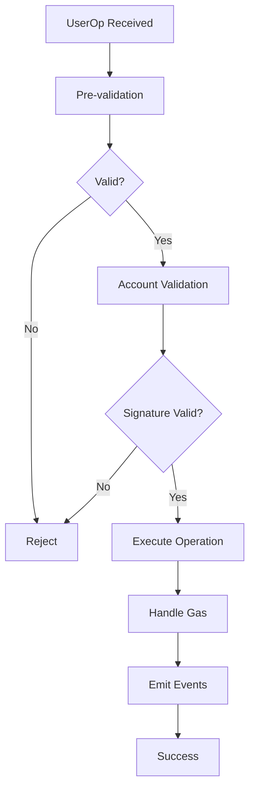

# EntryPoint v0.8 Overview

EntryPoint v0.8 is the latest version of the core contract in the ERC-4337 Account Abstraction ecosystem. This guide provides a comprehensive overview of its features, improvements, and how it processes UserOperations.

## What is EntryPoint v0.8?

EntryPoint v0.8 is a smart contract that serves as the central hub for processing UserOperations in the Account Abstraction ecosystem. It's responsible for:

- **Validation**: Verifying UserOp signatures and parameters
- **Execution**: Executing operations on account contracts
- **Gas Management**: Handling gas payments and refunds
- **Event Emission**: Providing tracking and monitoring capabilities

## Key Improvements in v0.8

### EIP-7702 Support
EntryPoint v0.8 introduces native support for EIP-7702 authorizations, enabling:
- **Delegated Authorization**: Accounts can delegate execution to other contracts
- **Enhanced Security**: More flexible authorization patterns
- **Gas Optimization**: Reduced gas costs for certain operations

### Enhanced Security
- **Improved Validation**: Better signature verification mechanisms
- **Anti-DoS Protection**: Enhanced protection against denial-of-service attacks
- **Gas Limit Enforcement**: Stricter gas limit validation

### Better Gas Optimization
- **Reduced Overhead**: Lower gas costs for common operations
- **Batch Processing**: More efficient handling of multiple UserOps
- **Smart Refunds**: Improved gas refund mechanisms

## Contract Addresses

### Mainnet
```
EntryPoint v0.8: 0x5FF137D4b0FDCD49DcA30c7CF57E578a026d2789
```

### Testnets
```
Sepolia: 0x5FF137D4b0FDCD49DcA30c7CF57E578a026d2789
Goerli: 0x5FF137D4b0FDCD49DcA30c7CF57E578a026d2789
```

## Core Functions

### handleOps()
The main function for processing UserOperations:

```solidity
function handleOps(
    UserOperation[] calldata ops,
    address payable beneficiary
) external;
```

**Parameters:**
- `ops`: Array of UserOperations to process
- `beneficiary`: Address to receive gas refunds

**Behavior:**
- Validates each UserOp
- Executes operations on account contracts
- Handles gas payments and refunds
- Emits events for tracking

### simulateValidation()
Simulates UserOp validation without execution:

```solidity
function simulateValidation(UserOperation calldata userOp) external;
```

**Purpose:**
- Test UserOp validity before submission
- Estimate gas costs
- Debug validation issues

### getUserOpHash()
Calculates the hash of a UserOp for signing:

```solidity
function getUserOpHash(UserOperation calldata userOp) 
    public view returns (bytes32);
```

**Returns:**
- `bytes32`: Hash to be signed by the user

## UserOp Processing Flow



## Validation Process

### 1. Pre-validation
- Check nonce uniqueness
- Validate gas limits
- Verify paymaster data (if present)
- Check account existence

### 2. Account Validation
- Verify signature
- Execute custom validation logic
- Check account permissions
- Validate paymaster sponsorship

### 3. Execution
- Execute the operation
- Handle gas payments
- Process refunds
- Emit tracking events

## Gas Management

### Gas Limits
EntryPoint v0.8 enforces several gas limits:

- **callGasLimit**: Maximum gas for operation execution
- **verificationGasLimit**: Maximum gas for validation
- **preVerificationGas**: Gas for pre-verification steps

### Gas Refunds
- **Account Refunds**: Accounts can receive gas refunds
- **Paymaster Refunds**: Paymasters can sponsor operations
- **Beneficiary Refunds**: Excess gas goes to beneficiary

## Event System

### UserOperationEvent
Emitted when a UserOp is processed:

```solidity
event UserOperationEvent(
    bytes32 indexed userOpHash,
    address indexed sender,
    address indexed paymaster,
    uint256 nonce,
    bool success,
    uint256 actualGasCost,
    uint256 actualGasUsed
);
```

### UserOperationRevertReason
Emitted when a UserOp fails:

```solidity
event UserOperationRevertReason(
    bytes32 indexed userOpHash,
    address indexed sender,
    uint256 nonce,
    bytes revertReason
);
```

## Security Considerations

### Signature Validation
- **ECDSA Verification**: Standard ECDSA signature validation
- **Custom Validation**: Support for custom validation logic
- **Replay Protection**: Nonce-based replay protection

### Gas Protection
- **Gas Limit Enforcement**: Strict gas limit validation
- **Anti-DoS**: Protection against denial-of-service attacks
- **Refund Limits**: Limits on gas refunds

### Access Control
- **Bundler Access**: Only authorized bundlers can submit UserOps
- **Paymaster Access**: Controlled paymaster integration
- **Admin Functions**: Restricted admin functions

## Integration with Bundlers

### Bundler Requirements
- **Authorization**: Must be authorized to submit UserOps
- **Gas Management**: Must handle gas payments correctly
- **Event Monitoring**: Should monitor UserOp events

### Submission Process
1. Bundler receives UserOp from client
2. Bundler validates UserOp locally
3. Bundler submits to EntryPoint
4. EntryPoint processes and executes
5. Bundler monitors for completion

## Best Practices

### For Developers
- **Gas Estimation**: Always estimate gas limits accurately
- **Error Handling**: Implement proper error handling
- **Event Monitoring**: Monitor UserOp events for status

### For Bundlers
- **Validation**: Validate UserOps before submission
- **Gas Management**: Handle gas payments correctly
- **Monitoring**: Monitor EntryPoint events

## Migration from v0.6

### Key Changes
- **EIP-7702 Support**: New authorization patterns
- **Enhanced Security**: Improved validation mechanisms
- **Gas Optimization**: Better gas efficiency
- **Event Changes**: Updated event structure

### Migration Steps
1. Update contract addresses
2. Update gas estimation logic
3. Update event handling
4. Test thoroughly on testnets

## Next Steps

Explore the complete EntryPoint v0.8 functionality:

1. **[API Reference](api-reference.md)** - Complete function reference
2. **[Security Considerations](security.md)** - Security best practices
3. **[Examples](examples/)** - Practical implementation examples

---

*Ready to dive deeper? Check out our [API Reference](api-reference.md) for complete function documentation.*
