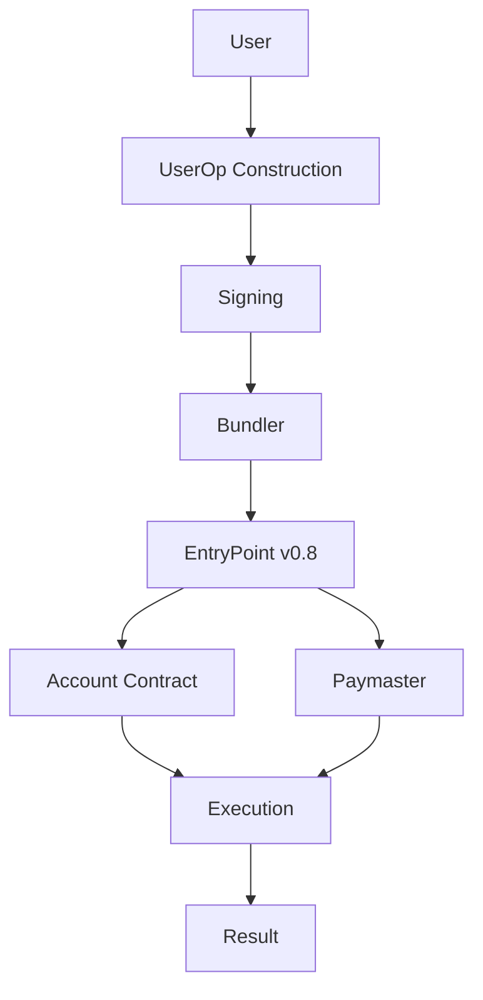

# UserOps Developer Guide

Welcome to the comprehensive developer guide for working with **EntryPoint v0.8** and **UserOperations (UserOps)**. This documentation provides everything you need to understand, implement, and submit UserOps using the latest EntryPoint contract.

## 🚀 What is EntryPoint v0.8?

EntryPoint v0.8 is the latest version of the core contract in the ERC-4337 Account Abstraction ecosystem. It serves as the central hub for processing UserOperations, enabling:

- **Account Abstraction**: Smart contract wallets with custom validation logic
- **Gasless Transactions**: Sponsored transactions through paymasters
- **Batch Operations**: Multiple operations in a single transaction
- **Enhanced Security**: Improved validation and anti-DoS mechanisms

## 🎯 Key Features

!!! success "New in v0.8"
    - **EIP-7702 Support**: Native support for EIP-7702 authorizations
    - **Enhanced Security**: Improved validation mechanisms
    - **Better Gas Optimization**: More efficient gas usage patterns
    - **Improved Error Handling**: Better error reporting and debugging

## 📚 Quick Navigation

### For New Developers
- **[Quick Start Guide](getting-started/quick-start.md)** - Get up and running in 5 minutes
- **[Understanding UserOps](userops/understanding.md)** - Learn the fundamentals
- **[Basic Examples](examples/basic-userop.md)** - Your first UserOp implementation

### For Experienced Developers
- **[EntryPoint v0.8 API Reference](entrypoint/api-reference.md)** - Complete API documentation
- **[Advanced Patterns](examples/advanced-patterns.md)** - Complex use cases and patterns
- **[Security Considerations](entrypoint/security.md)** - Best practices and security guidelines

## 🛠️ What You'll Learn

This guide covers:

1. **UserOperations Structure** - Understanding the components of a UserOp
2. **Construction & Validation** - Building and validating UserOps correctly
3. **Submission Process** - How to submit UserOps to EntryPoint v0.8
4. **Monitoring & Tracking** - Tracking UserOp status and events
5. **Error Handling** - Common issues and troubleshooting
6. **Best Practices** - Security and optimization guidelines

## 🏗️ Architecture Overview

## 🚦 Getting Started

Ready to dive in? Start with our [Quick Start Guide](getting-started/quick-start.md) to create your first UserOp in under 5 minutes.

!!! tip "Prerequisites"
    - Basic understanding of Ethereum and smart contracts
    - Familiarity with JavaScript/TypeScript or your preferred language
    - Access to an Ethereum node (mainnet, testnet, or local)

## 📖 Documentation Structure

- **[Getting Started](getting-started/)** - Installation, configuration, and first steps
- **[UserOps Guide](userops/)** - Deep dive into UserOperations
- **[EntryPoint v0.8](entrypoint/)** - Contract reference and API documentation
- **[Examples & Tutorials](examples/)** - Practical code examples
- **[Troubleshooting](troubleshooting/)** - Common issues and solutions

## 🤝 Contributing

Found an issue or want to contribute? This documentation is open source and community-driven. Check out our [contribution guidelines](contributing.md) to get started.

## 📞 Support

Need help? Check out our:
- **[FAQ](faq.md)** - Frequently asked questions
- **[Common Issues](troubleshooting/common-issues.md)** - Solutions to common problems
- **[Community Discord](https://discord.gg/entrypoint)** - Join our developer community

---

*Last updated: {{ git_revision_date_localized }}*
