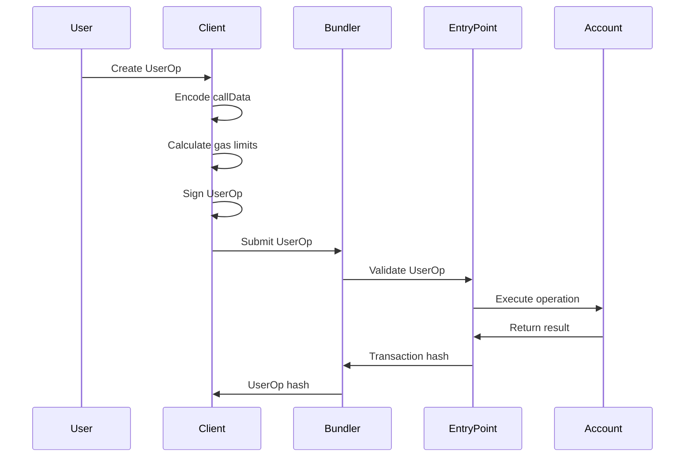

# Understanding UserOperations

UserOperations (UserOps) are the fundamental building blocks of the ERC-4337 Account Abstraction ecosystem. This guide explains their structure, components, and how they work with EntryPoint v0.8.

## What are UserOperations?

A UserOperation is a structure that describes a transaction to be executed by an account contract. Unlike traditional Ethereum transactions, UserOps are:

- **Abstraction Layer**: They abstract away the complexity of transaction execution
- **Batchable**: Multiple operations can be bundled together
- **Gasless**: Can be sponsored by paymasters
- **Customizable**: Support custom validation logic

## UserOp Structure

A UserOperation consists of the following fields:

```typescript
interface UserOperation {
  sender: string;           // Address of the account contract
  nonce: bigint;           // Anti-replay nonce
  initCode: string;        // Account initialization code
  callData: string;        // Encoded function call data
  callGasLimit: bigint;    // Gas limit for the call
  verificationGasLimit: bigint; // Gas limit for validation
  preVerificationGas: bigint;   // Gas for pre-verification
  maxFeePerGas: bigint;    // Maximum gas price
  maxPriorityFeePerGas: bigint; // Priority fee
  paymasterAndData: string; // Paymaster contract and data
  signature: string;        // User's signature
}
```

## Field Breakdown

### Core Fields

#### `sender`
- **Purpose**: The address of the account contract that will execute the operation
- **Type**: `string` (20-byte address)
- **Example**: `"0x742d35Cc6634C0532925a3b8D4C9db96C4b4d8b6"`

#### `nonce`
- **Purpose**: Prevents replay attacks and ensures operation ordering
- **Type**: `bigint`
- **Behavior**: Must be unique and sequential for each sender
- **Example**: `123n`

#### `initCode`
- **Purpose**: Code to deploy the account contract (if not already deployed)
- **Type**: `string` (hex-encoded bytes)
- **Empty**: `"0x"` if account already exists
- **Example**: `"0x608060405234801561001057600080fd5b50..."`

### Execution Fields

#### `callData`
- **Purpose**: Encoded function call data for the target operation
- **Type**: `string` (hex-encoded bytes)
- **Contains**: Function selector + encoded parameters
- **Example**: `"0xa9059cbb000000000000000000000000742d35cc..."`

#### `callGasLimit`
- **Purpose**: Maximum gas for executing the call
- **Type**: `bigint`
- **Estimation**: Should cover the actual operation cost
- **Example**: `100000n`

#### `verificationGasLimit`
- **Purpose**: Maximum gas for account validation
- **Type**: `bigint`
- **Usage**: Covers signature verification and custom validation
- **Example**: `100000n`

#### `preVerificationGas`
- **Purpose**: Gas for pre-verification steps
- **Type**: `bigint`
- **Fixed**: Usually `21000` (base transaction cost)
- **Example**: `21000n`

### Gas and Fees

#### `maxFeePerGas`
- **Purpose**: Maximum gas price willing to pay
- **Type**: `bigint` (in wei)
- **EIP-1559**: Part of the EIP-1559 fee structure
- **Example**: `20000000000n` (20 gwei)

#### `maxPriorityFeePerGas`
- **Purpose**: Priority fee for miners/validators
- **Type**: `bigint` (in wei)
- **EIP-1559**: Part of the EIP-1559 fee structure
- **Example**: `2000000000n` (2 gwei)

### Paymaster Integration

#### `paymasterAndData`
- **Purpose**: Paymaster contract address and additional data
- **Type**: `string` (hex-encoded)
- **Empty**: `"0x"` if no paymaster
- **Format**: `paymasterAddress + paymasterData`
- **Example**: `"0x0000000000000000000000000000000000000000"`

### Security

#### `signature`
- **Purpose**: Cryptographic signature proving authorization
- **Type**: `string` (hex-encoded bytes)
- **Algorithm**: ECDSA signature over UserOp hash
- **Length**: 65 bytes (r + s + v)
- **Example**: `"0x1234567890abcdef..."`

## UserOp Lifecycle



## Validation Process

EntryPoint v0.8 validates UserOps through several steps:

### 1. Pre-validation
- Check nonce uniqueness
- Verify gas limits are reasonable
- Validate paymaster data (if present)

### 2. Account Validation
- Verify account exists or can be created
- Check signature validity
- Execute custom validation logic

### 3. Execution
- Execute the operation
- Handle paymaster sponsorship
- Emit events for tracking

## Common Patterns

### Simple Transfer
```typescript
const userOp: UserOperation = {
  sender: accountAddress,
  nonce: currentNonce,
  initCode: '0x',
  callData: encodeTransfer(recipient, amount),
  callGasLimit: 21000n,
  verificationGasLimit: 100000n,
  preVerificationGas: 21000n,
  maxFeePerGas: parseUnits('20', 'gwei'),
  maxPriorityFeePerGas: parseUnits('2', 'gwei'),
  paymasterAndData: '0x',
  signature: '0x'
};
```

### Contract Interaction
```typescript
const userOp: UserOperation = {
  sender: accountAddress,
  nonce: currentNonce,
  initCode: '0x',
  callData: encodeContractCall(contractAddress, functionName, params),
  callGasLimit: 100000n,
  verificationGasLimit: 150000n,
  preVerificationGas: 21000n,
  maxFeePerGas: parseUnits('25', 'gwei'),
  maxPriorityFeePerGas: parseUnits('3', 'gwei'),
  paymasterAndData: '0x',
  signature: '0x'
};
```

### Paymaster Sponsored
```typescript
const userOp: UserOperation = {
  sender: accountAddress,
  nonce: currentNonce,
  initCode: '0x',
  callData: encodeOperation(target, value, data),
  callGasLimit: 50000n,
  verificationGasLimit: 100000n,
  preVerificationGas: 21000n,
  maxFeePerGas: parseUnits('20', 'gwei'),
  maxPriorityFeePerGas: parseUnits('2', 'gwei'),
  paymasterAndData: encodePaymasterData(paymasterAddress, paymasterData),
  signature: '0x'
};
```

## Best Practices

### Gas Estimation
- Always estimate gas limits accurately
- Include buffer for gas price fluctuations
- Test on testnets before mainnet

### Security
- Validate all inputs before signing
- Use secure random nonces
- Implement proper signature verification

### Error Handling
- Handle validation failures gracefully
- Implement retry logic for network issues
- Monitor UserOp status

## Next Steps

Now that you understand UserOp structure, explore:

1. **[Constructing UserOps](constructing.md)** - Learn to build UserOps programmatically
2. **[Submitting UserOps](submitting.md)** - Submit UserOps to bundlers
3. **[Monitoring UserOps](monitoring.md)** - Track UserOp execution

---

*Ready to build your first UserOp? Check out our [Constructing UserOps](constructing.md) guide.*
